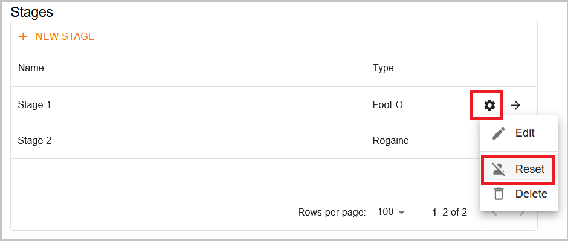

# What to Do If Something Goes Wrong

## Reset the Stage

If you encounter any issues while uploading start times or results
(e.g., uploading data to the wrong stage), you can reset the stage.
This will delete all the data uploaded to that stage, allowing you to start over.
When you reset a stage, it will be completely empty—just as if it had been newly created,
so you will need to re-upload the start times and results.

To reset a stage, go to the event page and click the settings wheel of that stage.
Then click the **"Reset"** option.

This option is also helpful if there are issues with runner information not displaying correctly.
For example, if a competitor’s class is changed, the system may treat it as a different person,
causing the runner to appear in both the old and new classes.
Resetting and re-uploading ensures that all information is accurately updated.
