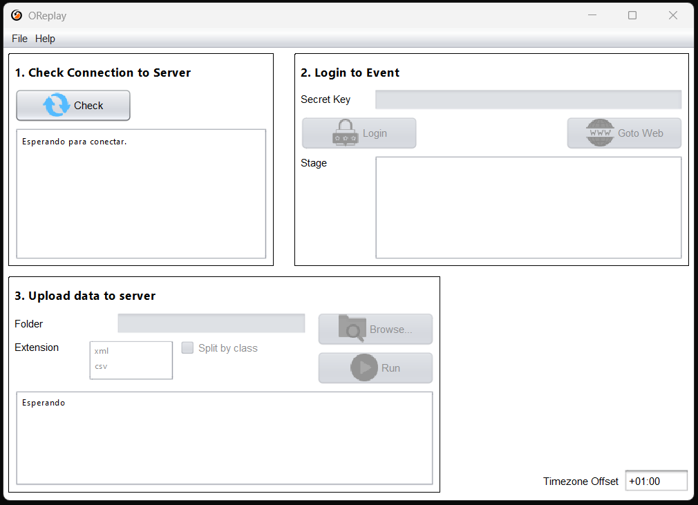

# Manage O-Replay Desktop Client

## Installing the Desktop Client in your PC {#installing-the-desktop-client-in-your-pc}

Results are uploaded using a small program that must be installed on your computer.
We provide an installer that works on Windows 11.
Simply follow the installer instructions.

[Download O-Replay Desktop Client 0.8.6](https://github.com/oreplay/desktop-client/releases/download/0.8.6/OReplayDesktop.exe)

For older Windows versions, such as Windows 10, you can still try the installer.
You might encounter a warning that the program contains malware, but don’t worry,
this is due to the absence of a digital signature not because we are a real malware.

If you are using other operating systems, such as Linux or macOS,
or if your Windows 10 installation fails,
you can still use the client via [manual installation](https://github.com/oreplay/desktop-client/releases/).

## Managing the Client {#managing-the-client}

Follow the next steps to upload files:

1. Check Connection to Server:

   Open the O-Replay Desktop Client and click **"Check connection"**.

2. Login to Event:

   Paste the security key (you will get it after creating the event on the web, we will se that later),
then click **"Enter"** and select the stage you want to upload data to.
You will get the event Id and security token when you create the event.

3. Upload data to Server:

   Choose the directory where you will export files to, then press **"Start"**.
The client will now monitor this folder for any `XML` or `csv` files.
When you export start times or results from your timekeeping software,
the client will read the file and upload it to O-Replay.
Files will be automatically deleted after successful uploads.

The option "Split by class" makes a different connection to the server for each class.
This option is recommended for low-speed or unstable connections.
