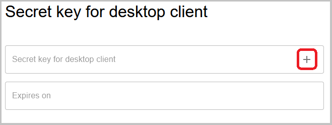

# Manage O-Replay WEB

## Register to O-Replay {/* #register-to-o-replay */}

Navigate to our [sign-up page](http://www.oreplay.es/sign-up) to create an account.

Please note that O-Replay is in active development.
Many planned features are not yet available, but the system is ready for its use.

## Create an Event {/* #create-an-event */}

Races in O-Replay are organized into events and stages.
For example, if you are running a weekend championship with middle and long-distance races,
you would create one event "Championship" with two stages:
"Middle Distance" and "Long Distance".
Each stage can represent a different orienteering discipline.

When you log in, you will see all your events.
You can also create new events.
Begin by filling in the event details, then add as many stages as needed.
If your event has only one race called "My First Race",
create an event named "My First Race" with one stage called "Race".
Only the event's name will be displayed.
Make sure to create at least one stage; otherwise, you will not be able to upload any data.

After creating the event and stages, generate a security token.
This token acts as a secret password for uploading results and can be shared with your team of timekeepers
without exposing your O-Replay credentials.
Please note that tokens expires one month after creation, but they can be renewed at any time.
When they are renewed, the old token becomes invalid and a new one is generated.
Use this option if your token gets compromised.

This is a test