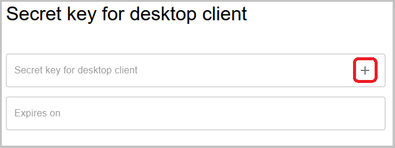

# Manage O-Replay WEB

:::danger[Beware // Atención]
This page is still being written. //
Esta página todavía se está escribiendo.
:::

## Register to O-Replay {/* #register-to-o-replay */}

Navigate to our [sign-up page](http://www.oreplay.es/sign-up) to create an account.

Please note that O-Replay is in active development.
Many planned features are not yet available, but the system is ready for its use.
Check out the [Features page](/features).

## Create an Event {/* #create-an-event */}

Races in O-Replay are organized into events and stages.
For example, if you are running a weekend championship with middle and long-distance races,
you would create one event "Championship" with two stages:
"Middle Distance" and "Long Distance".
Each stage can represent a different orienteering discipline.

When you log in, you will be redirected to the **"Dashboard"** page
(accessible from the main menu once logged in).
There, you will see all your events (if any),
and you can also create new events as follows:
1. Create an event by clicking the **"+"** button.
2. Fill in the event details and click save.
3. Add a new stage by clicking the **"+"** button.
4. Fill in the stage details and click save.
5. Repeat steps 3 and 4 to create as many stages as needed.

:::tip
You can edit all the event and stage details at any time.
:::

:::warning[Missing Organizer Name?]
If the club or entity is missing from the Organizer's drop-down, please,
contact us via email at **support@oreplay.es**
:::

:::info
Make sure to create at least one stage; otherwise, you will not be able to upload any data.
:::

## Manage the Secret Key {/* #manage-the-secret-key */}

After creating the event and stages, generate a `Secret Key` (or token).
This token acts as a secret password for uploading results
and can be shared with your team of timekeepers without exposing your O-Replay credentials.
Please note that tokens expires one month after creation, but they can be renewed at any time.
When they are renewed, the old token becomes invalid and a new one is generated.
Use this option if your token gets compromised.

