import Tabs from '@theme/Tabs';
import TabItem from '@theme/TabItem';

# Classic Stages

## Before the Race {/* #before-the-race */}

### Uploading Start Times {/* #uploading-start-times */}

Start times are uploaded for two purposes:
1. To display them for runners' information.
2. To show in-race times.

We only support IOF XML v3 files.
Get O-Replay Desktop Client ready for files and export the start times from your timekeeping software:

<Tabs groupId="timekeeping-software" queryString>
    <TabItem value="SportSoftware-2010" label="OE2010">
        You need to export the start times XML file.
        Go to **"Start list" → "Reports" → "Classes":**

        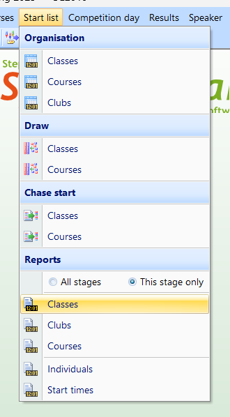

        From the top menu, choose **"Export":**

        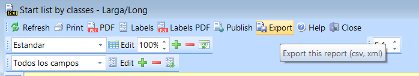

        Save using IOF XML v3 in the folder O-Replay Client is listening.

        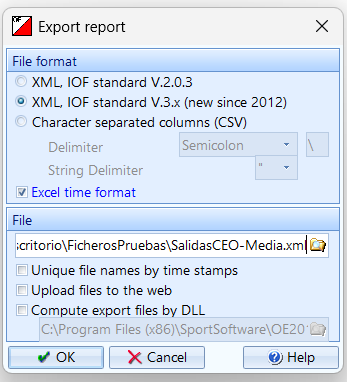
    </TabItem>
    <TabItem value="SportSoftware-12" label="OE12">
        You need to export the start times XML file.
        Go to **Start list → start list reports → by classes:**

        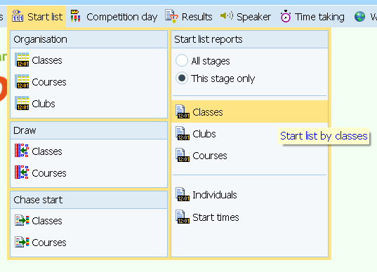

        From the top menu, choose **"Export"**

        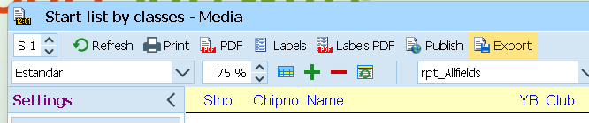

        Save using IOF XML in the folder O-Replay Client is listening.

        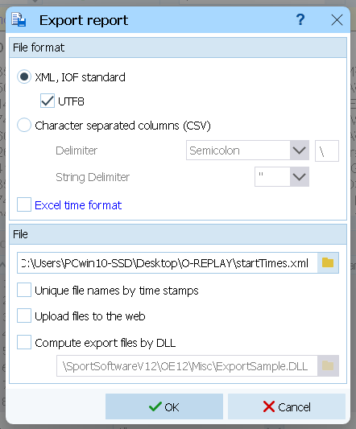
    </TabItem>
    <TabItem value="MeOS" label="MeOS">
        You need to export the start times XML file. Go to **Competition → Export data → Start List**

        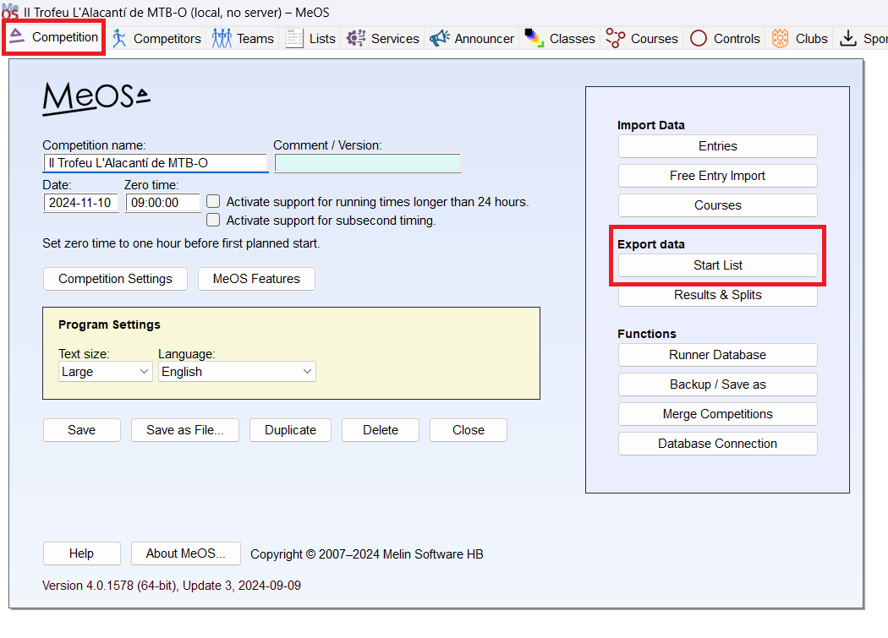

        Select all the classes, choose **"IOF Start List"**
        and export the file to the folder the client is listening to.

        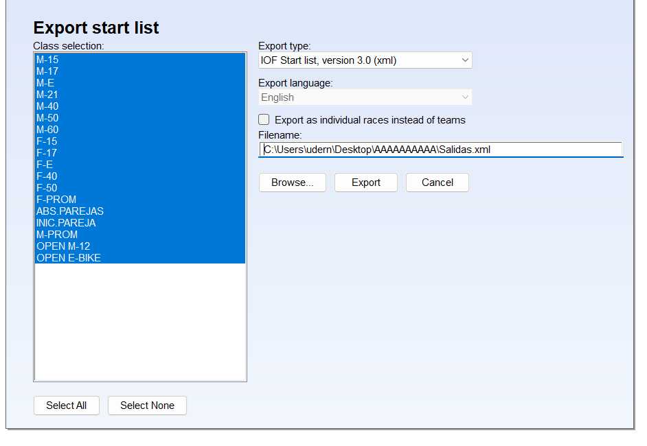
    </TabItem>
</Tabs>

:::tip[Multievent]

If your event has multiple stages, you will have to upload start times for each of the stages.

:::

:::info[Races without start times]
If you are using a start control and runners don’t have preassigned start times,
it is recommended to upload entries in IOF XML format.
This allows to display all the entries, and competitors can see how many runners are yet to finish.
:::

:::warning[Uploading start times after results]
No start times can be uploaded after uploading results.
If you want to upload start times after uploading results you need to Reset the stage first.
:::

## During the Race {/* #during-the-race */}

### Uploading Results {/* #uploading-results */}

We support IOF XML v3 splits files for uploading results.
Use an empty folder to save these files (you can reuse the folder created for start times).

:::tip
Check out the [Overall Results](./overall.mdx) page for multi-stage competitions.
:::

Get the client ready and listening for new files, then export result from your timekeeping software:

<Tabs groupId="timekeeping-software" queryString>
    <TabItem value="SportSoftware-2010" label="OE2010">
        You need to export the splits XML file. Go to **"Results" → "Splits times" → "Classes":**

        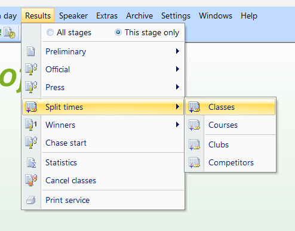

        Due to a bug in OE2010, you must export results without decimal places.
        In the settings menu at the left side, go to **"Report Formats"**
        and choose **"HH:MM:SS"** as the time format.

        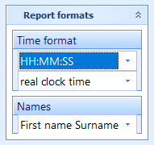

        You need to export all runners, including DNS.
        In the settings menu at the left side, go to **"More options" → "How many competitors?"**
        and choose **"All"**. Uncheck **"ExcLude dns"**.

        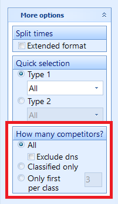

        Export regularly the splits using Automatic report.
        In the left side settings menu, go to **"Automatic report"**.
        Then, set the automatic actions only to **"export"** and your desired refresh interval.
        Finally, hit start.

        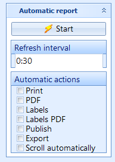

        Save using IOF XML v3 in the folder O-Replay Client is listening.

        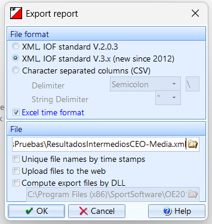
    </TabItem>
    <TabItem value="SportSoftware-12" label="OE12">
        You need to export the splits XML file. Go to **Results → Splits times → by classes:**

        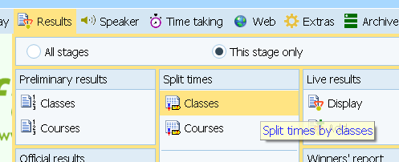

        You need to export all the runners. Uncheck the option **"Exclude dns"**.

        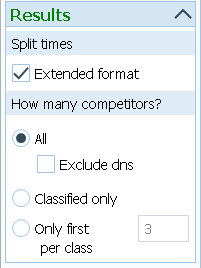

        Set the automatic report at your desired refresh interval.

        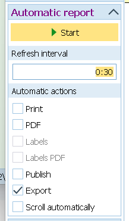

        Save using IOF XML in the folder O-Replay Client is listening.

        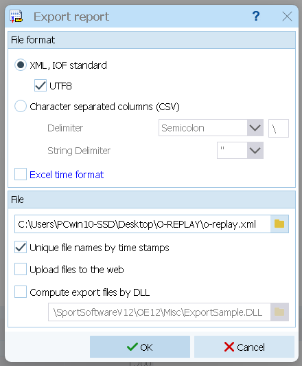
    </TabItem>
    <TabItem value="MeOS" label="MeOS">
        You need to export the splits XML file.
        Go to **Services → Available Services → Results Online**

        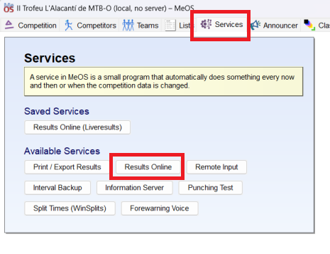

        This service has a lot of different configuration options. You have to set:
        - **Service Name**: O-Replay (optional)
        - **Time interval**: How frequent are the results updated.
        30 seconds or 1 minute are common values.
        - **Classes**: Choose all the classes.
        - **Export Format**: must be **"IOF XML 3.0"**
        - **Save to disk**: Is the only option that has to be ticked.
        Choose the folder O-Replay Client is listening to.

        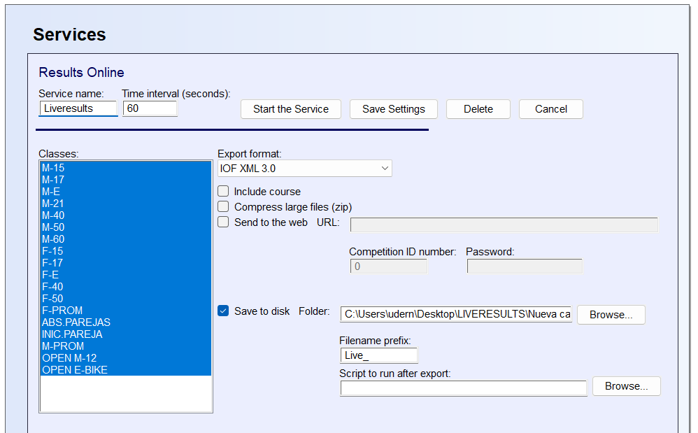
    </TabItem>
</Tabs>

:::warning[Regular results export (i.e., no splits)]
While the client supports uploading results files without splits, this is strongly discouraged.
Without splits, virtual tickets and split details cannot be displayed.
:::

:::warning[Upload failing with large number of runners]
If you are uploading a large number of results (e.g., about 1,000 runners)
that have not been uploaded previously, the process may take up to a minute.
If it takes longer than one minute, an error will occur.
In this case, try uploading the same results again two or three more times.
Some classes may already have been saved to the server, so the process will eventually be completed.
:::

:::tip
Check out the [Overall Results](./overall.mdx) page for multi-stage competitions.
:::

### Upload Online Controls {/* #upload-online-controls */}

If you are using online controls in your race, in addition to the previous steps,
you must export and upload those online splits.
If you are not using them, you can skip this section.
We support IOF XML v3. You can export the files to the same folder you are exporting splits.

<Tabs groupId="timekeeping-software" queryString>
    <TabItem value="SportSoftware-2010" label="OE2010">
        You need to export the online splits XML file.
        Go to **"Speaker" → "Intermediate results"**:

        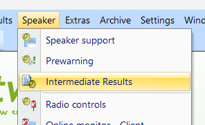

        We have to set the same settings as before.
        Export all competitors and uncheck **"Exclude dns"** option.
        Remember to set the report format to **HH:MM:SS**.
        Due to a bug in OE2010,
        exporting with decimal places will result in wrong times being displayed in O-Replay.

        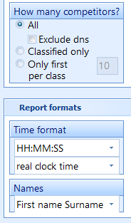

        Export the file at your desired refresh interval.

        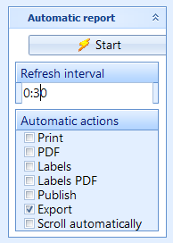

        Export using XML IOF v3.

        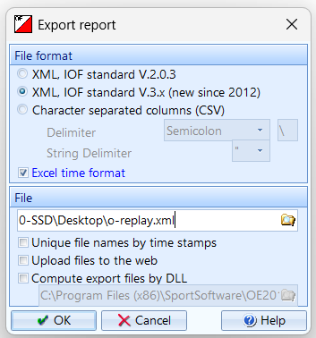
    </TabItem>
    <TabItem value="SportSoftware-12" label="OE12">
        You need to export the online splits XML file.
        Go to **"Speaker" → "Intermediate results"**:

        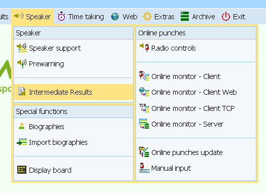

        We have to set the same settings as before.
        Export all competitors and uncheck **"Exclude dns"** option.

        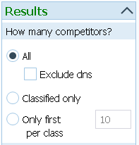

        Export the file at your desired refresh interval.

        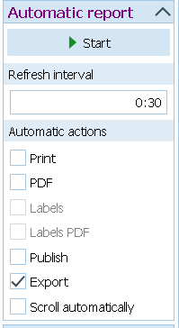

        Export using XML IOF v3.

        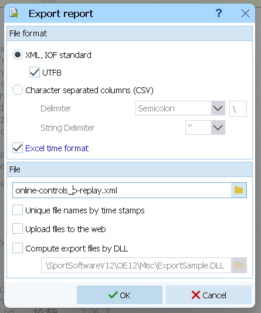
    </TabItem>
    <TabItem value="MeOS" label="MeOS">
        Do you know how to do it in MeOS? help us complete the documentation!
    </TabItem>
</Tabs>

## Other considerations {/* #other-considerations */}

:::tip
Check out the [Overall Results](./overall.mdx) page for multi-stage competitions.
:::

:::note[Using multiple results platforms]

Some people ask whether they can upload results to both Liveresultats and O-Replay simultaneously.
Liveresultats has served us well for many years, and we truly appreciate its contributions.
However, we firmly believe that O-Replay is the future,
offering all the same features and many more in a more user-friendly way.

That said, if you choose to use both platforms, you must export the files to separate folders.
Otherwise, both clients will compete for access—reading, processing,
and deleting the same files—which will prevent either from functioning correctly.

:::

