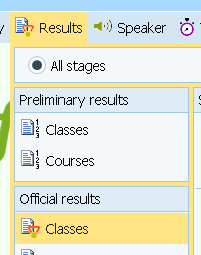
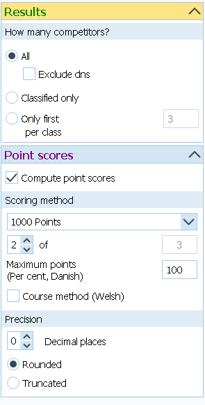
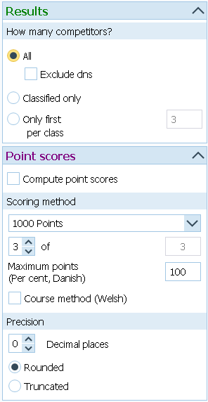
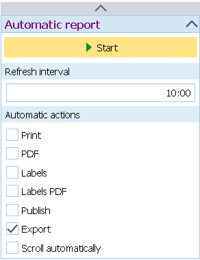
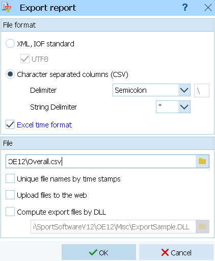

import Tabs from '@theme/Tabs';
import TabItem from '@theme/TabItem';

# Overall Results

## Uploading Multi-Stage Overall Results {/* #uploading-multi-stage-overall-results */}

It is common for multi-stage competitions to award prizes based on the results of all races.
In such cases, the overall result of a runner is calculated either as the sum of
their individual race times or as the sum of the points earned in each race according
to a specific formula. Both methods are supported.
Additionally, in some competitions,
only X out of Y races count toward the final result; this option is also supported.

There is a special stage type called 'overalls' used to store these results.
This stage is automatically created when you upload overall results for the first time.
It does not matter which stage you are uploading results to; the overall file will be
automatically recognized and uploaded to the special 'overalls' stage.
You also do not need to specify in advance whether you are uploading time-based or
point-based results; the system automatically detects the type.

<Tabs groupId="timekeeping-software" queryString>
    <TabItem value="SportSoftware-2010" label="OE2010">
        You must upload the results using the '.csv' format.
        If you choose the '.xml' format, point-based events will not be uploaded correctly.
        Make sure you use semicolon (;) as delimiter and double quotes (") as string delimiter!
    </TabItem>
    <TabItem value="SportSoftware-12" label="OE12">
        You must upload the results using the '.csv' format.
        If you choose the '.xml' format, point-based events will not be uploaded correctly.
        Go to **Results → All stages → Official results → Classes**

        

        Setup your computation method.
        An example of a **point-based** overall result using 1000-point formula.
        The best 2 out of 3 stages are used.

        

        This is an example of a **time-based** overall result

        

        Go to the 'Automatic report' and export the results at your desired export interval.",

        

        Export the file to the folder O-Replay is listening to using '.csv' format. Make sure you use semicolon (;) as delimiter and \" as string delimiter!",

        
    </TabItem>
    <TabItem value="MeOS" label="MeOS">
        Do you know how to do it in MeOS? help us complete the documentation!
    </TabItem>
</Tabs>
