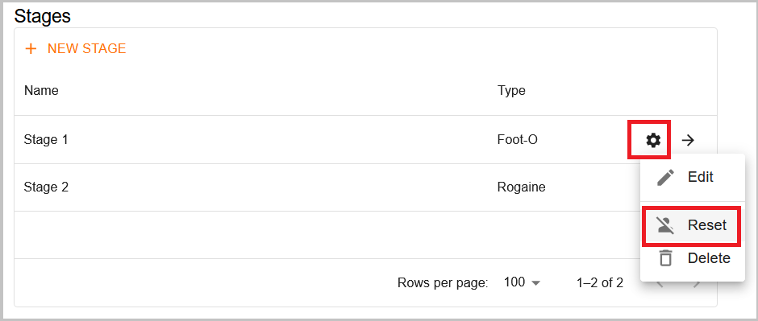

# Qué Hacer Si Algo Va Mal

:::danger[Beware // Atención]
This page is still being written. //
Esta página todavía se está escribiendo.
:::

## Restablecer la Etapa {/* #reset-the-stage */}

Si tiene algún problema al subir las horas de salida o los resultados
(por ejemplo, si sube datos en la etapa equivocada), puede restablecer la etapa.
Esto borrará todos los datos cargados en esa etapa, permitiéndole empezar de nuevo.
Al restablecer una etapa, ésta quedará completamente vacía (como si se hubiera creado de nuevo),
por lo que tendrá que volver a cargar las horas de salida y los resultados.

Para restablecer una etapa, vaya a la página del evento y pulsa en la rueda de ajustes de esa etapa.
A continuación, pulsa en la opción **"Restablecer"**.

Esta opción también es útil si hay problemas con la información de algún corredor que no se muestra correctamente.
Por ejemplo, si se cambia la categoría de un competidor, el sistema puede tratarlo como una persona diferente,
haciendo que el corredor aparezca tanto en la categoría antigua como en la nueva.
Restablecer y volver a subir los datos garantiza que toda la información se actualice correctamente.

## Usando múltiples plataformas de resultados {/* #using-multiple-results-platforms */}

Mucha gente pregunta si se pueden subir resultados a Liveresultats y a O-Replay simultáneamente.
Liveresultats ha hecho un gran trabajo durante muchos años.
Sin embargo, creemos firmemente que O-Replay es el futuro,
ya que ofrece todas sus funcionalidades y muchas más con una interfaz más moderna e intuitiva.

Dicho esto, si decides utilizar ambas plataformas, debes exportar los archivos a carpetas separadas.
De lo contrario, ambos clientes competirán por el acceso (leer, procesar
y eliminar los mismos archivos), lo que hará que ninguno de los dos funcione correctamente.
