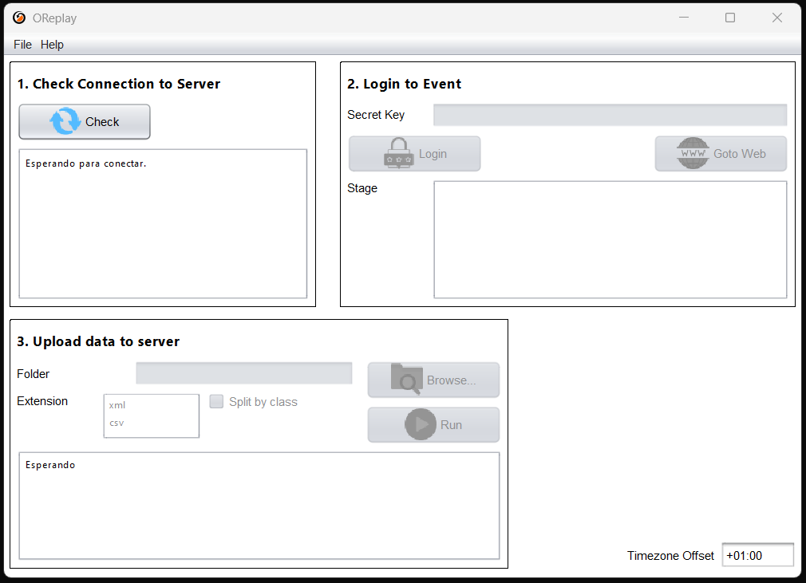

# Gestiona O-Replay Desktop Client

:::danger[Beware // Atención]
This page is still being written. //
Esta página todavía se está escribiendo.
:::

## Instala del cliente de escritorio en tu PC {/* #installing-the-desktop-client-in-your-pc */}

Los resultados se suben usando un pequeño programa que debe instalarse en su ordenador.
Proporcionamos un instalador que funciona en Windows 11.
Simplemente siga las instrucciones del instalador.

[Descargar O-Replay Desktop Client 0.8.7](https://github.com/oreplay/desktop-client/releases/download/0.8.7/OReplayDesktop.exe)

Para versiones anteriores de Windows, como Windows 10, puedes probar el instalador.
Es posible que encuentre una advertencia de que el programa contiene malware, pero no se preocupe,
esto se debe a la ausencia de una firma digital y no porque seamos un malware real.

Si utilizas otros sistemas operativos, como Linux o macOS,
o si la instalación a una versión de Windows más antigua falla,
puedes seguir utilizando el cliente mediante [instalación manual](https://github.com/oreplay/desktop-client/releases/).

## Gestiona el Cliente {/* #managing-the-client */}

Siga los siguientes pasos para subir archivos:

1. Comprobar conexión al servidor:

   Abra el Cliente de escritorio de O-Replay, pulsa en **"Comprobar"** y espera hasta que se establezca la conexión.

2. Login a un evento:

   Pega la `Clave Secreta` (mira como conseguirla [aquí](/docs/setup/web#manage-the-secret-key)),
   luego pulsa el botón **"Entrar"** y selecciona la etapa a la que quieres subir los datos.

3. Subir datos al servidor:

   Elija la carpeta a la que exportará los archivos y pulse **"Arrancar"**.
   El cliente buscará en esta carpeta cualquier archivo `XML` or `csv`.
   Cuando exporte horas de salida o resultados desde su programa de cronometraje,
   el cliente leerá el archivo y subirá los datos a O-Replay.
   Los archivos se borrarán automáticamente después de subirlos con éxito.

:::tip
La opción "Separar categorías" hace una conexión diferente al servidor para cada categoría.
Esta opción se recomienda para conexiones lentas o inestables (especialmente en eventos grandes).
:::

