import Tabs from '@theme/Tabs';
import TabItem from '@theme/TabItem';

# Etapas Clásicas

:::danger[Beware // Atención]
This page is still being written. //
Esta página todavía se está escribiendo.
:::

## Antes de la Carrera {/* #before-the-race */}

### Subir Horas de Salida {/* #uploading-start-times */}

Las horas de salida se suben con dos fines:
1. Mostrarlas para información a los corredores.
2. Para mostrar los tiempos en carrera.

Sólo admitimos archivos IOF XML v3.
Prepara el Cliente de Escritorio para archivos XML y exporte las horas de salida desde su software de cronometraje:

<Tabs groupId="timekeeping-software" queryString>
    <TabItem value="SportSoftware-2010" label="OE2010">
        Debe exportar el archivo XML de horas de salida.
        Vaya a **"Listados de salida" → "Informes" → "categorías":**

        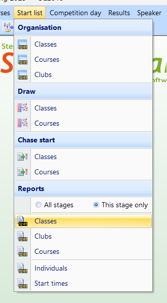

        En el menú superior, seleccione **"Exportar":**

        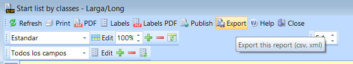

        Guardar usando IOF XML v3 en la carpeta que el cliente está utilizando.

        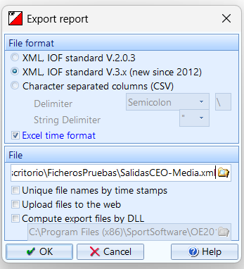
    </TabItem>
    <TabItem value="SportSoftware-12" label="OE12">
        Debe exportar el archivo XML de horas de salida.
        Vaya a **Listado de salidas → informes de listado de salida → por categorías:**

        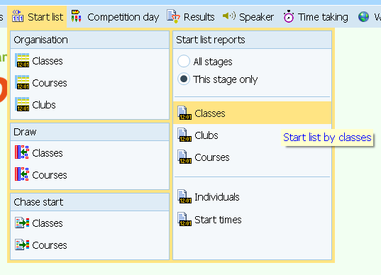

        En el menú superior, seleccione **"Exportar"**

        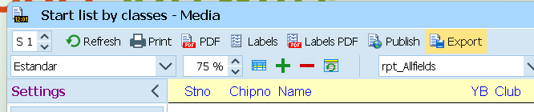

        Guardar usando IOF XML v3 en la carpeta O-Replay Client está utilizando.

        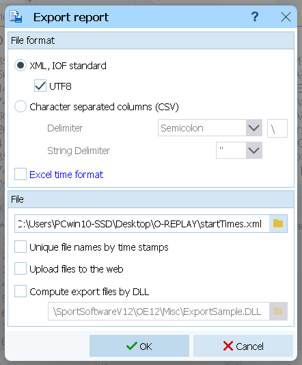
    </TabItem>
    <TabItem value="MeOS" label="MeOS">
        Debe exportar el archivo XML de las horas de salida.
        Vaya a **Competición → Exportar datos → Listado de salidas**

        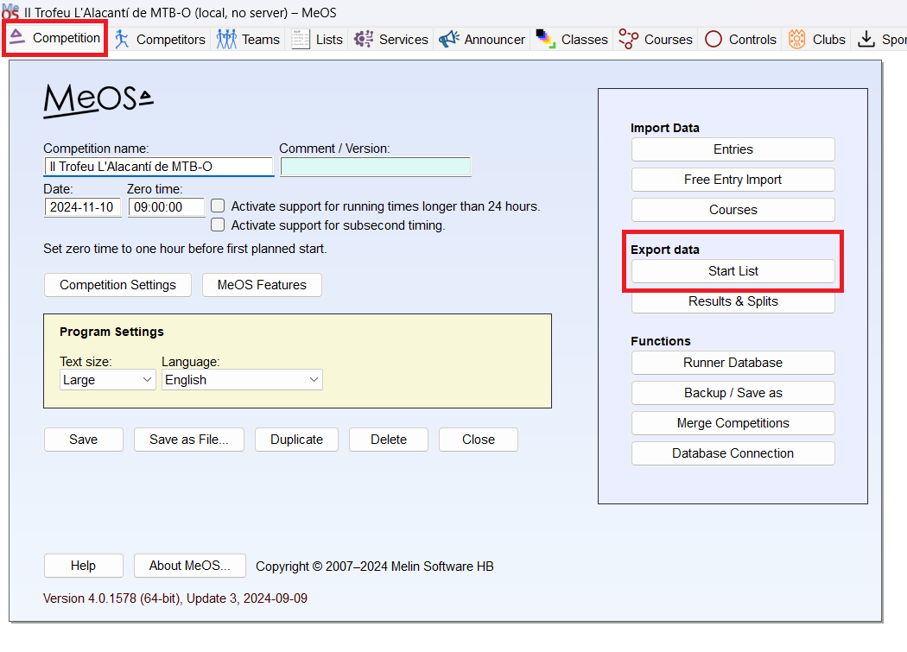

        Seleccione todas las categorías, elija **"Lista de salida de IOF"**
        y exporte el archivo a la carpeta que el cliente está escuchando.

        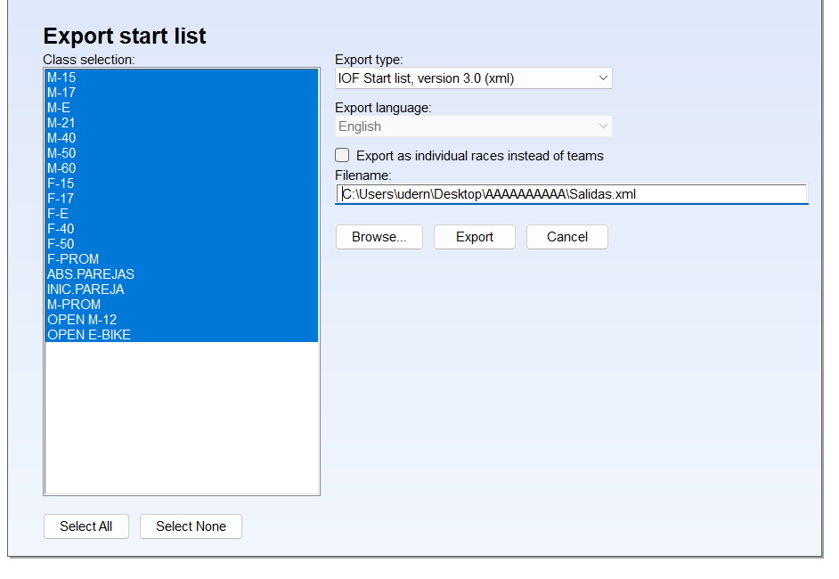
    </TabItem>
</Tabs>

:::tip[Multievento]
Si su evento tiene varias etapas, tendrá que subir las horas de salida de cada una de ellas.
:::

:::info[Carreras sin hora de salida]
Si utiliza un control de salida y los corredores no tienen horas de salida preasignadas,
se recomienda subir las inscripciones en formato XML IOF.
Esto permite mostrar todas las inscripciones, y los competidores pueden ver cuántos corredores faltan por terminar.
:::

:::warning[Subida de las horas de salida después de los resultados]
No se pueden subir horas de salida después de subir resultados.
Si desea subir las horas de salida después de subir los resultados, primero debe reestablecer la etapa.
Consulte la [página de Gestión de Errores](/docs/errors/) para más información sobre el tema.
:::

## Durante la Carrera {/* #during-the-race */}

### Subir Resultados {/* #uploading-results */}

Admitimos archivos de parciales IOF XML v3 para subir los resultados.
Utilice una carpeta vacía para guardar estos archivos (puede reutilizar la carpeta creada para las horas de salida).

:::tip
Revisa la página de [Resultados Totales](./overall.mdx) para competiciones multi-etapa.
:::

Prepare el cliente, luego exporte los archivos desde su programa de crnometraje:

<Tabs groupId="timekeeping-software" queryString>
    <TabItem value="SportSoftware-2010" label="OE2010">
        Debe exportar el archivo XML de parciales.
        Vaya a **"Resultados" → "Parciales" → "categorías":**

        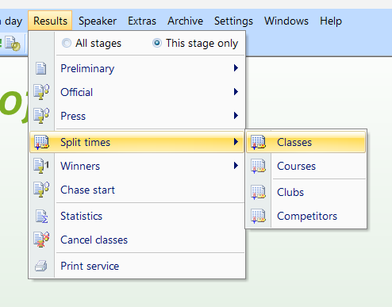

        Debido a un error en OE2010, debe exportar los resultados sin decimales.
        En el menú de configuración de la izquierda, vaya a **"Formatos de informe"**
        y elija **"HH:MM:SS"** como formato de hora.

        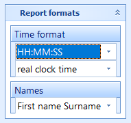

        Necesitas exportar todos los corredores, incluyendo No sale.
        En el menú de configuración de la izquierda, vaya a **"Más opciones"** → **"¿Cuántos competidores?"**
        y elija **"Todos"**. Desmarque **"Excluir No sale"**.

        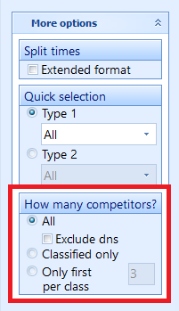

        Exporte regularmente los parciales utilizando el informe automático.
        En el menú de configuración de la izquierda, vaya a **"Informe automático"**.
        A continuación, marque **"exportar"** y el intervalo de actualización que desee.
        Por último, pulse **"Inicio"**.

        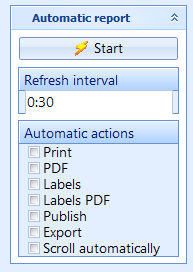

        Guardar usando IOF XML v3 en la carpeta que el cliente de escritorio está utilizando.

        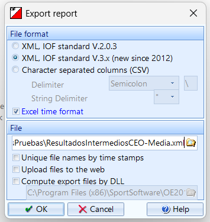
    </TabItem>
    <TabItem value="SportSoftware-12" label="OE12">
        Debe exportar el archivo XML de
        Vaya a **Resultados → Parciales → Categorías:**

        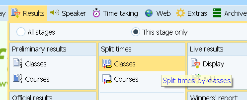

        Tienes que exportar todos los corredores. Desmarque la opción **"Excluir los que no salen"**.

        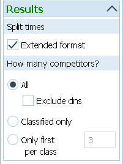

        Establezca el informe automático en el intervalo de actualización que desee.

        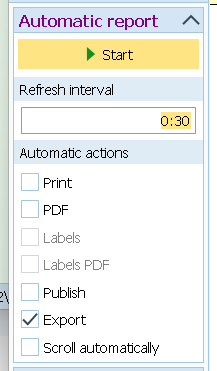

        Guardar usando IOF XML en la carpeta en que el cliente está escuchando.

        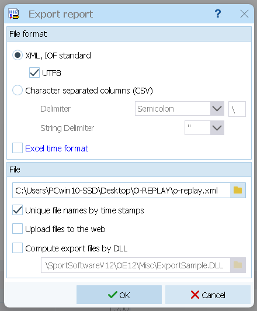
    </TabItem>
    <TabItem value="MeOS" label="MeOS">
        Debe exportar el archivo XML de parciales.
        Vaya a **Servicios → Servicios disponibles → Resultados en línea**

        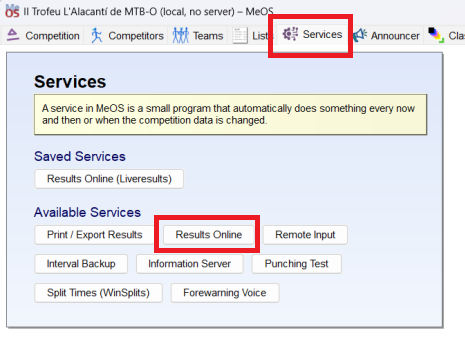

        Este servicio tiene muchas opciones de configuración. Tienes que configurar:
        - **Nombre del servicio**: O-Replay (optional)
        - **Intervalo de tiempo**: Con qué frecuencia se actualizan los resultados.
        30 segundos o 1 minuto son valores comunes.
        - **Categorías**: Elige todas las categorías.
        - **Formato de exportación**: debe ser **"IOF XML 3.0"**
        - **Guardar en disco**: Es la única opción que hay que marcar.
        Elige la carpeta en la que O-Replay Client está utilizando.

        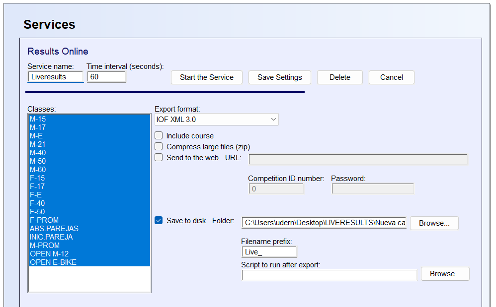
    </TabItem>
</Tabs>

:::warning[Exportación normal de resultados (es decir, sin parciales)]
Aunque el cliente permite cargar archivos de resultados sin parciales, se desaconseja encarecidamente hacerlo.
Sin parciales, no se pueden mostrar los ticket digitales ni los detalles de los parciales.
:::

:::warning[La subida falla con un gran número de corredores]
Si está subiendo un gran número de resultados con parciales (por ejemplo, unos 1.000 corredores)
que no se han subido previamente, el proceso puede tardar hasta un minuto.
Si tarda más de un minuto, se producirá un error.
En este caso, se intentará volver a cargar los mismos resultados dos o tres veces más.
Es posible que algunas categorías ya se hayan guardado en el servidor, por lo que el proceso acabará completándose.
:::

### Subir Radiocontroles {/* #upload-online-controls */}

Si estás utilizando radiocontroles en tu carrera, además de los parciales,
debes exportar y subir estas picadas.
Si no los utiliza, puede saltarse esta sección.
Aceptamos IOF XML v3.
Puedes exportar los archivos a la misma carpeta en la que estás exportando los parciales.

<Tabs groupId="timekeeping-software" queryString>
    <TabItem value="SportSoftware-2010" label="OE2010">
        Debe exportar el archivo XML de tiempos intermedios.
        Vaya a **"Comentarista"** → **"Resultados intermedios"**:

        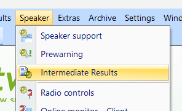

        Tenemos que establecer la misma configuración que antes.
        Exporte todos los competidores y desmarque la opción **"Excluir los que no salen"**.
        Recuerda establecer el formato del informe en **HH:MM:SS**.
        Debido a un error en OE2010, exportar con decimales hará que se muestren tiempos erróneos en O-Replay.

        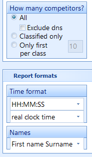

        Exporte el archivo con el intervalo de actualización que desee.

        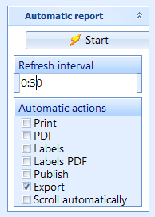

        Exportación mediante XML IOF v3.

        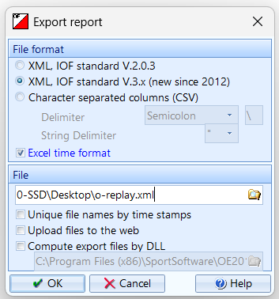
    </TabItem>
    <TabItem value="SportSoftware-12" label="OE12">
        Debe exportar el archivo XML de tiempos intermedios.
        Vaya a **"Comentarista" → "Resultados intermedios"**:

        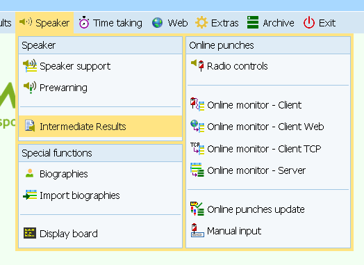

        Tenemos que establecer la misma configuración que antes.
        Exportar todos los competidores y desmarcar la opción **"Excluir los que no salen"**.

        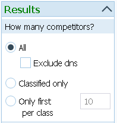

        Exporte el archivo con el intervalo de actualización que desee.

        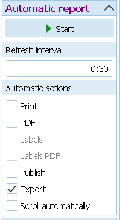

        Exportación mediante XML IOF v3.

        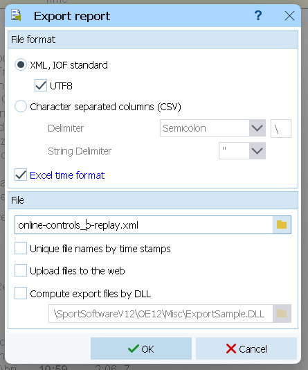
    </TabItem>
    <TabItem value="MeOS" label="MeOS">
        ¿Sabes cómo se hace en MeOS? ¡Ayúdanos a completar la documentación!
    </TabItem>
</Tabs>

## Otras consideraciones {/* #other-considerations */}

:::tip
Mira la página de [Resultados Totales](./overall.mdx) para competiciones multi-etapa.
:::

:::note[Usando múltiples plataformas de resultados]
Alguna persona se pregunta si se pueden subir resultados a Liveresultats y a O-Replay simultáneamente.
Consulte la pàgina de [Gestionando Errors](/docs/errors/#using-multiple-results-platforms) para más información sobre ese tema.
:::
