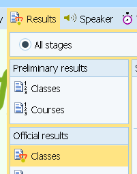
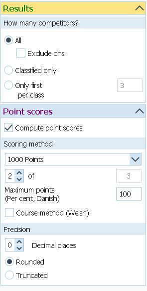
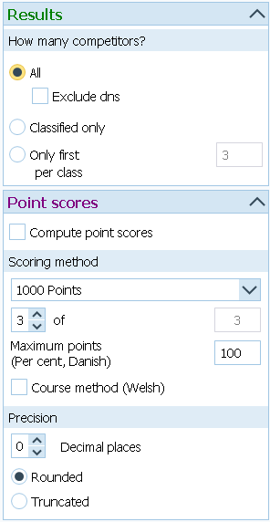
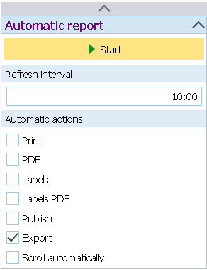
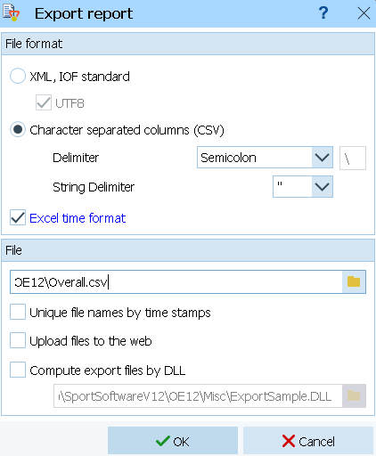

import Tabs from '@theme/Tabs';
import TabItem from '@theme/TabItem';

# Resultados Totales

:::danger[Beware // Atención]
This page is still being written. //
Esta página todavía se está escribiendo.
:::

## Subir Resultados Totales en Multi-Etapas {/* #uploading-multi-stage-overall-results */}

En competiciones con varias etapas es común hacer una clasificación global del evento.
En estos casos, el resultado total se calcula como la suma de tiempos de todas las carreras
o como la suma de puntos tras aplicar alguna fórmula. Ambos métodos están disponibles en O-Replay.
Además, algunas comepeticiones tienen en cuenta el resultado de solo las X mejores de Y etapas.
También contamos con esta posibilidad.

Hay un tipo especial de etapa llamada "totales" para guardar este tipo de resultados.
La etapa se crea automáticamente cuando subes por primera vez resultados totales,
aunque también se puede crear de forma manual con antelación.
No importa a que etapa estés subiendo resultados; los archivos de resultados totales se identifican
y se envían a la etapa correcta automáticamente.
Tampoco hace falta indicar en ningún sitio si el resultado total se basa en tiempos o en puntos;
el sistema detecta el tipo automáticamente.

<Tabs groupId="timekeeping-software" queryString>
    <TabItem value="SportSoftware-2010" label="OE2010">
        Sube los resultados usando únicamente el formato '.csv' para resultados basados en puntos.
        Si se utiliza el formato '.xml' los eventos basados en puntos no se representarán correctamente, solo los basados en tiempos.
        ¡Asegurate de usar el punto y coma (;) como separador y las comillas (") como separador de cadenas de texto!
    </TabItem>
    <TabItem value="SportSoftware-12" label="OE12">
        Sube los resultados usando únicamente el formato '.csv' para resultados basados en puntos.
        Si se utiliza el formato '.xml' los eventos basados en puntos no se representarán correctamente, solo los basados en tiempos.

        Ve a **Resultados → Todas las etapas → Resultados oficiales → Categorías**

        

        Configura el método de cálculo utilizado.
        En la imagen puedes ver un ejemplo de **totales por puntos** usando la fóruma de los 1000 puntos.
        Solo se tienen en cuenta las mejores 2 etapas de 3 que tenía ese evento.

        

        La siguiente imagen muestra un ejemplo de totales como **suma de tiempos**.

        

        Diríjase a 'Informe automático' y exporte los resultados con el intervalo deseado.

        

        Exporte el archivo a la carpeta en la que el cliente está escuchando, en formato '.csv'.
        ¡Asegurate de usar el punto y coma (;) como separador y las comillas (") como separador de cadenas de texto!

        
    </TabItem>
    <TabItem value="MeOS" label="MeOS">
        ¿Sabes cómo se hace en MeOS? ¡Ayúdanos a completar la documentación!
    </TabItem>
</Tabs>
